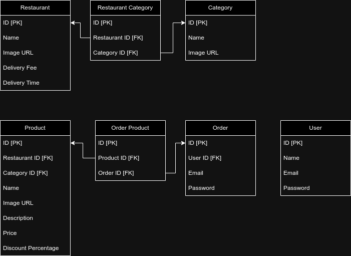

# Fullstack Week Food

Projeto desenvolvido durante o treinamento da Fullstack Week instruido pelo Filipe Rocha - Dicas para Devs. 
Uma aplicação de Food, clone do IFood.

### project
<video>
  <source />
</video>

## Techs
- ReactJS
- TypeScript
- TailwindCSS
- Next.js
- PostgreSQL
- Prisma
- Shadcn/ui

## Config
- Prettier
- Husky
- ESLint
- Git Hooks

## screens

## UML

